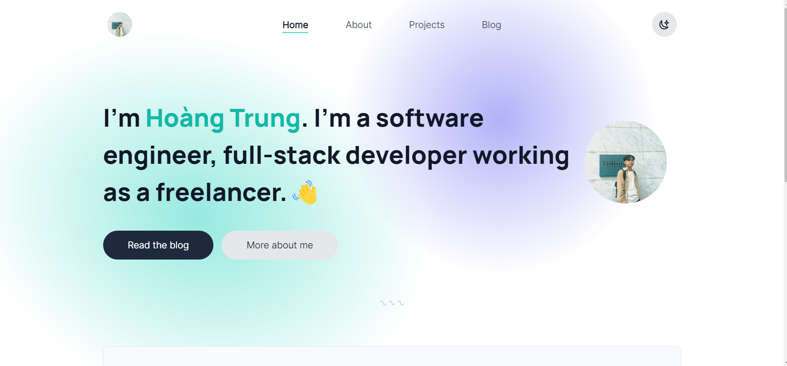

# hoangtrung1801's Portfolio 👋


> This is a website that I made to display my background, skills, and projects. In addition, this is a place I will post my blogs in the future as blogger.

## Preview



### ✨ [Demo](https://hoangtrung1801.tech)

## Run

Setup your enviroment variables like file .env.example

```sh
yarn install
```

```sh
yarn && yarn preview
```

## Author

👤 **hoangtrung1801**

-   Github: [@hoangtrung1801](https://github.com/hoangtrung1801)

⭐️ Thank you [@braydoncoyer](https://github.com/braydoncoyer) for inspiring from your portfolio.

## Show your support

Give a ⭐️ if this project helped you!

---
